# OPG Scanning

OPG Scanning is a Go-based microservice designed to perform scanning and document extraction and processing operations. It is containerized with Docker Compose for both standard and Sirius-integrated environments.

## Overview

The OPG Scanning service enables you to run tests, build the application, and perform security and lint analysis through a set of defined Makefile commands. The project is structured for rapid local development and integration testing with external dependencies such as Localstack and a Sirius mock service.

## Requirements

For local development and testing you will need:

- [Docker](https://www.docker.com/get-started)
- [Docker Compose](https://docs.docker.com/compose/install/)
- [Golang](https://golang.org) (>= 1.24.0 - if you plan on running tests outside of Docker)

## Usage

1. **Running Unit Tests**

   ```bash
   make test
   ```

   This command builds the test container and runs all unit tests.

2. **Running Integration Tests**

   ```bash
   make integration-test
   ```

   This will start the app, run the integration tests via the provided test script, and perform cleanup.

3. **Starting the Application**

   ```bash
   make start
   ```

   To run with Sirius integration:

   ```bash
   make start-sirius
   ```

4. **Cleaning Up**

   To stop and remove all Docker Compose resources, run:

   ```bash
   make clean
   ```

5. **For linting**

   ```bash
   make go-lint
   ```

6. **For security scanning**
   ```bash
   make gosec
   ```

## Testing locally with Sirius and Postman

_If you don't need to check how Sirius processes an XML upload, you can just use `make start` to run the scanning app without Sirius_

To start the scanning app with a connection to Sirius, first start running Sirius locally and then run the `make start-sirius` command in opg-scanning. This uses the `docker-compose.sirius.yml` file to connect the scanning app to the Sirius docker network and passes uploads to Sirius's localstack instance to be processed asynchronously.

Load [the Postman collection](scripts/OPG%20Scanning.postman_collection.json) into Postman (or any tool which supports it). You will need to set the following environment variables for the local environment.

| Variable name | Value                                        |
| ------------- | -------------------------------------------- |
| baseURL       | http://localhost:8081                        |
| auth_email    | opg_document_and_d@publicguardian.gsi.gov.uk |
| auth_password | password                                     |

More generally, the email/password need to match a value in the `/local/local-credentials` SSM parameter.

## Architecture



## Resources

[Sirius-integration OpenAPI Specification](docker/sirius/openapi.yaml)
